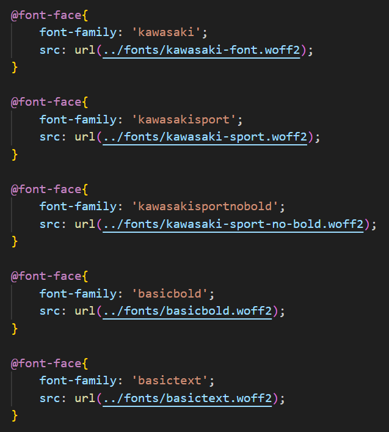

# Procesverslag
Markdown is een simpele manier om HTML te schrijven.  
Markdown cheat cheet: [Hulp bij het schrijven van Markdown](https://github.com/adam-p/markdown-here/wiki/Markdown-Cheatsheet).

Nb. De standaardstructuur en de spartaanse opmaak van de README.md zijn helemaal prima. Het gaat om de inhoud van je procesverslag. Besteedt de tijd voor pracht en praal aan je website.

Nb. Door *open* toe te voegen aan een *details* element kun je deze standaard open zetten. Fijn om dat steeds voor de relevante stuk(ken) te doen.

## Jij

  
uitwerken voor kick-off werkgroep

  ### Auteur:
  Yu'an Lucht

  #### Je startniveau:
  Blauwe Piste? Heel misschien een rode piste?

  #### Je focus:
  De website mooier maken, en tegerlijketijd toegankelijker voor de mobiele telefoon. 
 

## Je website

  
uitwerken voor kick-off werkgroep

  ### Je opdracht:
  kawasaki.nl

  #### Screenshot(s) van de eerste pagina (small screen): 
  hier de naam van de pagina  
  

  #### Screenshot(s) van de tweede pagina (small screen):
  hier de naam van de pagina  
  
 

## Toegankelijkheidstest 1/2 (week 1)

  
uitwerken na test in 2e werkgroep

  ### Bevindingen
  Lijst met je bevindingen die in de test naar voren kwamen:
  -De website is niet te gebruiken op de telefoon
  -Content mist op telefoon formaat
  -Scrollen gaat lastig op telefoon
  -Animaties werken wel maar stroef (scrol animatie)
  -Code is NIET samantisch
  -De website is ook niet / lastig te gebruiken met je keyboard
  -De website gebruikt geen H1's en geen Li/ul/ol

## Breakdownschets (week 1)

  
uitwerken na afloop 3e werkgroep

  ### de hele pagina: 
  

  ### dynamisch deel (bijv menu): 
  

  ### wellicht nog een dynamisch deel (bijv filter): 
  

## Voortgang 1 (week 2)

  
uitwerken voor 1e voortgang

  ### Stand van zaken
  Het opzetten van de HTML was goed te doen, ik merk zeker een verschil tuseen samanische coden en alleen maar divjes en classes. Ik heb ook geleerd hoe ik een formulier goed moet schrijven. Css gaat was stroefer omdat ik meer nu niet met divjes moet werken maar andere termen die ik nog niet ken.

  ### Agenda voor meeting
  samen met je groepje opstellen

  | Yuan           | Anna               | stefan       | levi             |
  | ---            | ---                | ---          | ---              |
  | Hoe ik een     | Afbeelding plaatsen| website goed | en dan ik dat    |
  | grid correct   |in html met een link| responsive   | dit wil ik zeker |
  | correct moet   |is dat oke? en of   | inrichten en | ...              |
    schrijven en    meerdere secties oke  hoe pas ik 
    toepassen       oke zijn.             een image 
                                          groote aan op
                                          beide formaten

  ### Verslag van meeting
  hier na afloop snel de uitkomsten van de meeting vastleggen

  - Ik heb geleerd hoe ik grid goed moet gebruiken om tekst onder elkaar te zetten zonder een br
  - Hoe ik een @fontface moet gebruiken, en om de fonts te downloaden
  - 
  

## Voortgang 2 (week 3)

  
uitwerken voor 2e voortgang

  ### Stand van zaken
  Het begrijpen van Grid vind ik nogsteeds lastig, maar het gaat steeds beter. Wat wel steeds lastiger gaat
  is ele kleine details, zoals het precies gelijk maken van sections, images ook precies gelijk maken, en het aanpassen van formulieren.
  
  Zoals je ziet, de knop is niet in het center, de artiekelen zijn niet gelijk. etc.

  ### Agenda voor meeting
  samen met je groepje opstellen

  | Yu'an          | student 2          | student 3    | student 4        |
  | hoe maak ik de | ---                | ---          | ---              |
  | fotos gelijk   | en dit             | en ik dit    | en dan ik dat    |
  | aan elkaar. En | dit als er tijd is | nog een punt | dit wil ik zeker |
  | Hoed houd ik de| ...                | ...          | ...              |
    forms even
    groot? bij het
    kleiner maken.

  ### Verslag van meeting
  hier na afloop snel de uitkomsten van de meeting vastleggen

  - punt 1
  - punt 2
  - nog een punt
- ...

## Toegankelijkheidstest 2/2 (week 4)

  
uitwerken na test in 9e werkgroep

  ### Bevindingen
  Lijst met je bevindingen die in de test naar voren kwamen (geef ook aan wat er verbeterd is):

## Voortgang 3 (week 4)

  
uitwerken voor 3e voortgang

  ### Stand van zaken
  hier dit ging goed & dit was lastig (neem ook screenshots op van delen van je website en code)

  ### Agenda voor meeting
  samen met je groepje opstellen

  | student 1      | student 2          | student 3    | student 4        |
  | ---            | ---                | ---          | ---              |
  | dit bespreken  | en dit             | en ik dit    | en dan ik dat    |
  | en dat ook nog | dit als er tijd is | nog een punt | dit wil ik zeker |
  | ...            | ...                | ...          | ...              |

  ### Verslag van meeting
  hier na afloop snel de uitkomsten van de meeting vastleggen

  - punt 1
  - punt 2
  - nog een punt
  - ...

## Eindgesprek (week 5)

  
uitwerken voor eindgesprek

  ### Je uitkomst - karakteristiek screenshots:
  

  ### Dit ging goed/Heb ik geleerd: 
  Korte omschrijving met plaatjes

  

  ### Dit was lastig/Is niet gelukt:
  Korte omschrijving met plaatjes

  

## Bronnenlijst

  
continu bijhouden terwijl je werkt

  Nb. Wees specifiek ('css-tricks' als bron is bijv. niet specifiek genoeg). 
  Nb. ChatGpT en andere AI horen er ook bij.
  Nb. Vermeld de bronnen ook in je code.

  1. bron 1
  2. bron 2
  3. ...

