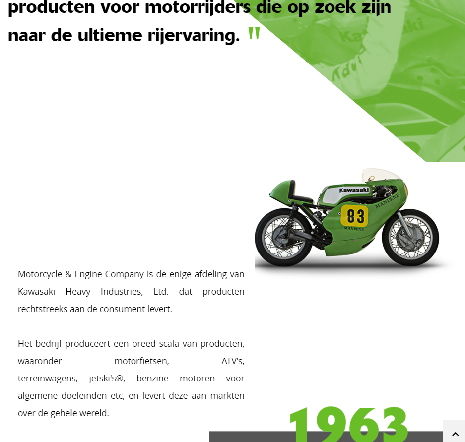
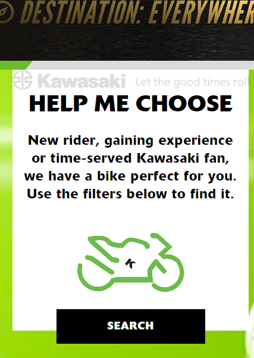
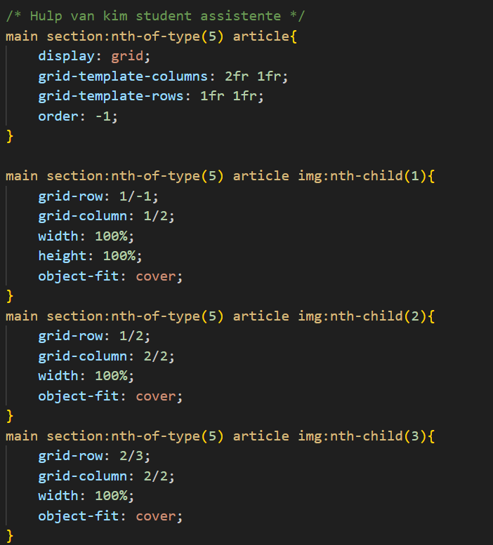
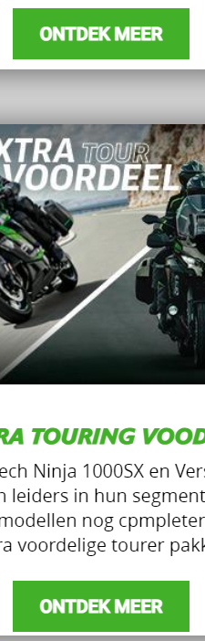

# Procesverslag
Markdown is een simpele manier om HTML te schrijven.  
Markdown cheat cheet: [Hulp bij het schrijven van Markdown](https://github.com/adam-p/markdown-here/wiki/Markdown-Cheatsheet).

Nb. De standaardstructuur en de spartaanse opmaak van de README.md zijn helemaal prima. Het gaat om de inhoud van je procesverslag. Besteedt de tijd voor pracht en praal aan je website.

Nb. Door *open* toe te voegen aan een *details* element kun je deze standaard open zetten. Fijn om dat steeds voor de relevante stuk(ken) te doen.

## Jij

  
uitwerken voor kick-off werkgroep

  ### Auteur:
  Yu'an Lucht

  #### Je startniveau:
  Blauwe Piste? Heel misschien een rode piste?

  #### Je focus:
  De website toegankelijker voor de mobiele telefoon maken.
 

## Je website

  
uitwerken voor kick-off werkgroep

  ### Je opdracht:
  kawasaki.nl

  #### Screenshot(s) van de eerste pagina (small screen): 
  Kawasaki nederland https://www.kawasaki.nl/nl/products
  

  #### Screenshot(s) van de tweede pagina (small screen):
  Kawasaki kernwaarden https://www.kawasaki.nl/nl/about_kawasaki/Kernwaarden?Uid=0B39XF4OX1ENCV4KXVxeXAkLXAoLDlpQDVsMDF4NDlAOUF1GBgRFJiQ
  
 

## Toegankelijkheidstest 1/2 (week 1)

  
uitwerken na test in 2e werkgroep

  ### Bevindingen
  Lijst met je bevindingen die in de test naar voren kwamen:
  -De website is niet te gebruiken op de telefoon
  -Content mist op telefoon formaat 
  -Scrollen gaat lastig op telefoon
  -Animaties werken wel maar stroef (scrol animatie)
  -Code is NIET samantisch
  -De website is ook niet / lastig te gebruiken met je keyboard
  -De website gebruikt geen H1's en geen Li/ul/ol

## Breakdownschets (week 1)

  
uitwerken na afloop 3e werkgroep

  ### de hele pagina: 
  

  ### dynamisch deel (bijv menu): 
  

  ### wellicht nog een dynamisch deel (bijv filter): 
  

## Voortgang 1 (week 2)

  
uitwerken voor 1e voortgang

  ### Stand van zaken
  Het opzetten van de HTML was goed te doen, ik merk zeker een verschil tuseen samanische coden en alleen maar divjes en classes. Ik heb ook geleerd hoe ik een formulier goed moet schrijven. Css gaat was stroefer omdat ik meer nu niet met divjes moet werken maar andere termen die ik nog niet ken.

  ### Agenda voor meeting
  samen met je groepje opstellen

  | Yuan           | Anna               | stefan       | levi             |
  | ---            | ---                | ---          | ---              |
  | Hoe ik een     | Afbeelding plaatsen| website goed | en dan ik dat    |
  | grid correct   |in html met een link| responsive   | dit wil ik zeker |
  | correct moet   |is dat oke? en of   | inrichten en | ...              |
    schrijven en    meerdere secties oke  hoe pas ik 
    toepassen       oke zijn.             een image 
                                          groote aan op
                                          beide formaten

  ### Verslag van meeting
  hier na afloop snel de uitkomsten van de meeting vastleggen

  - Ik heb geleerd hoe ik grid goed moet gebruiken om tekst onder elkaar te zetten zonder een br
  - Hoe ik een @fontface moet gebruiken, en om de fonts te downloaden
  -  
  

## Voortgang 2 (week 3)

  
uitwerken voor 2e voortgang

  ### Stand van zaken
  Het begrijpen van Grid vind ik nogsteeds lastig, maar het gaat steeds beter. Wat wel steeds lastiger gaat
  is kleine details, zoals het precies gelijk maken van sections, images ook precies gelijk maken, en het aanpassen van formulieren.
  

  ### Agenda voor meeting
  samen met je groepje opstellen

  | Yu'an          | student 2          | student 3    | student 4        |
  | hoe maak ik de | ---                | ---          | ---              |
  | fotos gelijk   | en dit             | en ik dit    | en dan ik dat    |
  | aan elkaar. En | dit als er tijd is | nog een punt | dit wil ik zeker |
  | Hoed houd ik de| ...                | ...          | ...              |
    forms even
    groot? bij het
    kleiner maken.

  ### Verslag van meeting
  Ik liep tegen een paar problemen aan, sommige elementen waren niet in het midden terwijl mijn margin auto en place content op center stond

  - Ik heb kleine fouten gemaakt zoals procenten gebruikt op verkeerde plekken waardoor dingen niet goed mee scalen
  - Grid gaat ook weer steeds beter nu ik het goed uitgelegd heb gekregen.
  - nog een punt
- ...

## Toegankelijkheidstest 2/2 (week 4)

  
uitwerken na test in 9e werkgroep

  ### Bevindingen
  Uit mijn test is er uit gekomen dat mijn hele website te gebruiken is met de Tab knop en de screenreader,
  Ook is mijn code samantisch en die van Kawasaki nederland niet. Hun site is daarnaast ook niet goed
  responsive, wanneer ik mijn scherm verklein op hun website, mis ik content, zoals hun video en de 
  "zoek jou perfecte motor" form is niet beschrikbaar. Bij mij uiteraard wel.

## Voortgang 3 (week 4)

  
uitwerken voor 3e voortgang

  ### Stand van zaken
  Mijm website is goed opweg, de screenreader en het tabben door mijn website gaat goed en lukt. echter is nogsteeds mijn hamburger menu niet zichtbaar. Ik weet nogsteeds niet waarom, ik ben hier al 2 weken mee bezig.
  Mijn tweede pagina is bijna klaar en mijn footer is af.

  ### Agenda voor meeting
  samen met je groepje opstellen

  | Yuan           | levi               | Anna         | stefan           |
  | ---            | ---                | ---          | ---              |
  | Voor mijn tw-  | Waarom zijn A's    | Hulp met gr- | hulp bij het     |
  | eede pagina is | niet weken in zijn | id, om het   | correct maken    |
  | is het oke als | ham burger menu    | responsive   | van zijn HTML    |
    als ik 1 pagina                       te maken       select menu
    maak maar wel
    het menu uitwerk
    en responsive 
    maak?

  ### Verslag van meeting
  hier na afloop snel de uitkomsten van de meeting vastleggen

  - Het is oke als ik 1 pagina maar maar wel het menu responsive maak.
  - hoe ik een image met clip-path:polygon kan aanpassen.
  - 
  - ...

## Eindgesprek (week 5)

  
uitwerken voor eindgesprek

  ### Je uitkomst - karakteristiek screenshots:
  

  ### Dit ging goed/Heb ik geleerd: 
  Ik heb geleerd hoe ik grid als basis kan gebruiken, ook heb ik geleerd hoe ik een plaatje kan editen in 
  CSS, (met clip-path). Dit zijn 2 hele handige dingen om in mijn vrije tijd te kunnen gebruiken en verder 
  te leren. Over het algemeen heb ik ook geleerd hoe mijn HTML goed samantisch moet zijn en heb ik een veel
  betere basis van CSS kunnen ontwikkelen.

  

  ### Dit was lastig/Is niet gelukt:
  Grid vond ik heel lastig, ik snap het heel eerlijk gezegd nog steeds niet 100% maar ik heb een basis.
  Ik heb bij grid heel veel ondersteuning moeten krijgen om het een beetje kunnen begrijpen, maar het 
  gaat alleen maar beter komen vanaf hier.

  

## Bronnenlijst

  
continu bijhouden terwijl je werkt

  Nb. Wees specifiek ('css-tricks' als bron is bijv. niet specifiek genoeg). 
  Nb. ChatGpT en andere AI horen er ook bij.
  Nb. Vermeld de bronnen ook in je code.

  1. MDN
  2. Mijn broer
  3. Gesprekken op school
  4. Student assistenten
  5. AI (chat gpt)

